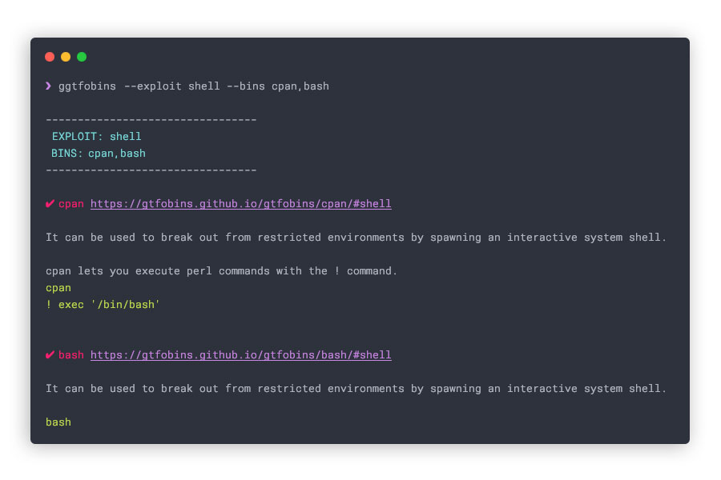

# Get GTFOBINS
Get info from [GTFOBins](https://gtfobins.github.io/) about a given exploit from the command line

## Install
`go get github.com/CristinaSolana/ggtfobins`

or [grab the latest binary](https://github.com/CristinaSolana/ggtfobins/releases)

## Usage
`ggtfobins  --exploit suid --bins bash,cat`

## Docker Usage
1. `docker pull nightshiftc/ggtfobins`
2. `docker run -it nightshiftc/ggtfobins --exploit sudo --bins vim`

## Command not found error
Run `export PATH=$PATH:$(go env GOPATH)/bin`

## Available Exploits
- bind-shell
- capabilities
- command
- file-download
- file-read
- file-upload
- file-write
- library-load
- limited-suid
- non-interactive-bind-shell
- non-interactive-reverse-shell
- reverse-shell
- shell
- sudo
- suid

---

[Contribute to GTFOBins](https://gtfobins.github.io/contribute/)

---

Follow GTFOBins' creators:
- [norbemi](https://twitter.com/norbemi)
- [cyrus_and](https://twitter.com/cyrus_and)

Follow [me](https://twitter.com/0xStoek)
